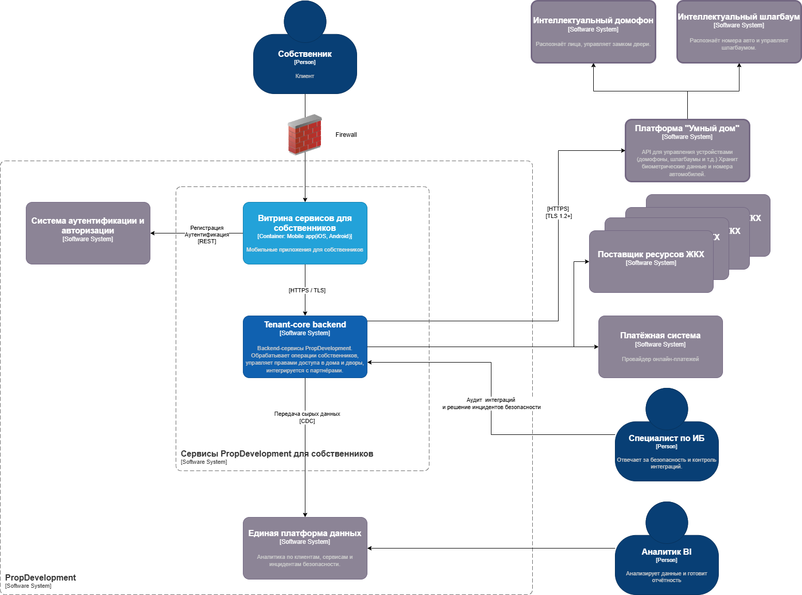
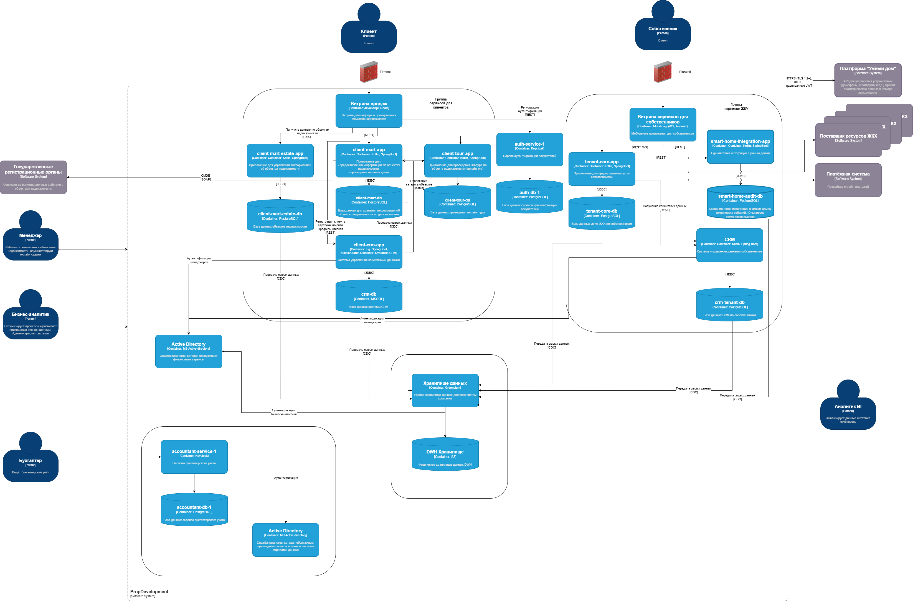
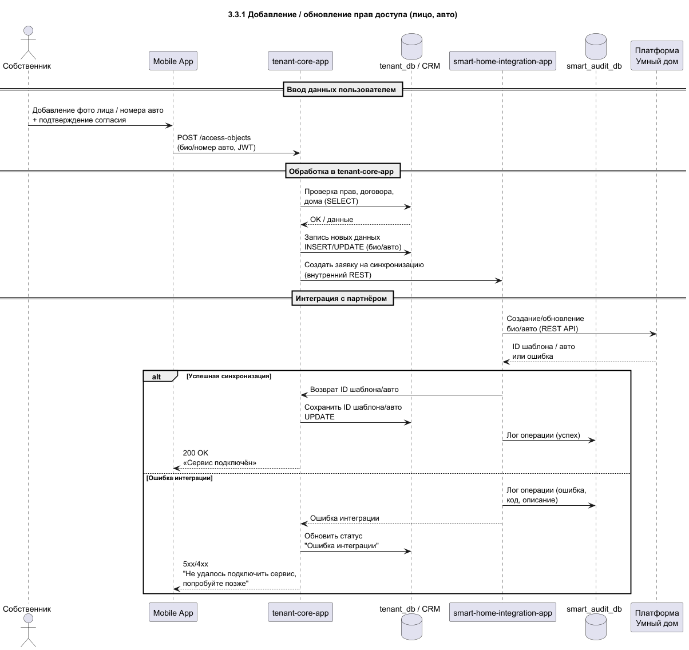
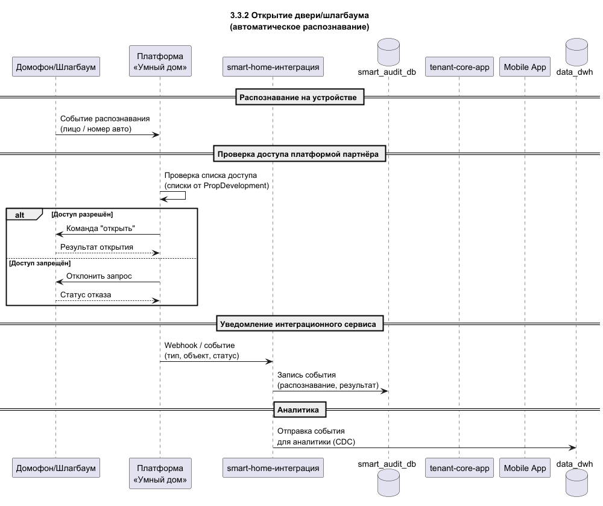
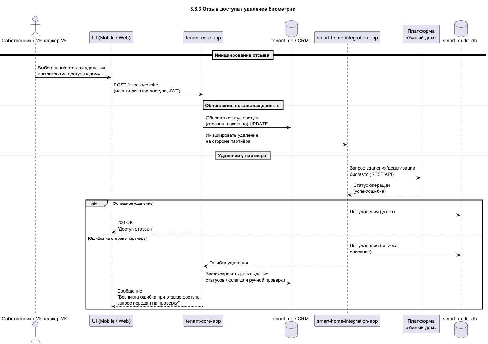

## 1. Диаграмма контекста (C4, System Context) - PlantUML
### Пояснение.
Новый сервис для интеграции с платформой Умного дома входит в состав системы сервисов для собственника.

---

## 2. Диаграмма контейнеров (C4, Container) - с учётом новых сервисов

**Идея:**
Мы не ломаем весь ландшафт, а добавляем управляемую точку интеграции: **`smart-home-integration-app`** + более строгую схему авторизации и логирования взаимодействия с партнёром.

---

## 3. Требования к внешним интеграциям

### 3.1. Требования к безопасности

1. **Единая точка входа для партнёра:**

    * Все интеграции с платформой "Умный дом" проходят через **-`smart-home-integration-app`**, а не напрямую из разных сервисов PropDevelopment.
    * Это позволяет централизованно реализовать контроль данных, аудит, ограничения по договорам и доменам, устраняя текущую проблему "каждый ходит к партнёрам как хочет".

2. **Шифрование трафика:**

    * Все внешние вызовы к API партнёра - только по **HTTPS/TLS 1.2+**.
    * Для server-to-server взаимодействия между -`smart-home-integration-app` и API партнёра - **mTLS** (взаимная аутентификация сертификатами).
    * Ключи и сертификаты хранятся в защищённом хранилище (HSM/Secret Manager).

3. **Минимизация и классификация данных:**

    * К платформе партнёра передаются только те данные, которые необходимы для работы домофона и шлагбаума:

        * идентификатор собственника/квартиры (не полные ФИО, а внутренний ID, псевдоним),
        * идентификатор домофона/входа,
        * идентификатор автомобиля (номер, при необходимости - захешированный или псевдонимизированный),
        * биометрические шаблоны - только в форме, согласованной с законодательством и политикой обработки ПДн.
    * Используется политика классификации данных (персональные, биометрические, технические) и соответствующие меры защиты для каждой категории.

4. **Обработка биометрии и номеров автомобилей:**

    * Явное **согласие пользователя** на обработку биометрии и распознавание номера автомобиля.
    * В PropDevelopment хранится:

        * информация о факте согласия,
        * ссылка/идентификатор биометрического шаблона у партнёра (а не сам шаблон, если по договору шаблон хранит партнёр).
    * При отзыве согласия PropDevelopment отправляет партнёру команду на удаление/деактивацию шаблона и номера автомобиля.

5. **Сегментация сети и периметр:**

    * Сервис `smart-home-integration-app` развёрнут в **DMZ / отдельном сегменте**, трафик к нему фильтруется межсетевым экраном.
    * Внутренний доступ к `smart-home-integration-app` - только из доверенных подсетей и сервисов (tenant-core-app и др.).
    * Внешние IP-адреса партнёра фиксированы и добавлены в белый список.

6. **Аудит и журналирование:**

    * Все вызовы к API партнёра:

        * логируются с техническими атрибутами (время, объект, тип операции, результат),
        * привязываются к пользователю/квартире через внутренние идентификаторы (для расследований инцидентов).
    * Логи хранятся отдельно (smart_audit_db), с ограниченным доступом (только ИБ, аудит, уполномоченные администраторы).
    * Аудит доступа к логам.

7. **Ограничение по объёму и частоте:**

    * Rate limiting и защитные механизмы (ограничение числа запросов в единицу времени, защита от повторных вызовов).
    * Обработка аномалий: слишком частые запросы с одной стороны, подозрительные паттерны (например, массовый запрос статусов доступа).

8. **Управление инцидентами:**

    * Все ошибки безопасности (401/403 от партнёра, неожиданные данные, нарушенная схема) фиксируются в отдельном журнале и отправляются в SIEM/систему мониторинга.
    * Формализованный процесс реагирования: кто и как действует при инцидентах (блокировка интеграции, откат, уведомление пользователей).

---

### 3.2. Протоколы аутентификации и авторизации

1. **Мобильное приложение -> PropDevelopment:**

    * **OAuth 2.1 / OpenID Connect**:

        * авторизация пользователей через IdP (auth),
        * access-token в виде JWT с ролями и scope:

            * `scope: smart_home:read`, `smart_home:control`, `vehicle:manage`, etc.
    * Tenant-core-app доверяет только токенам, выданным внутренним IdP.

2. **PropDevelopment -> Платформа партнёра (-`smart-home-integration-app`):**

    * **Client Credentials / mTLS + JWT**:

        * -`smart-home-integration-app` аутентифицируется на стороне партнёра по TLS-сертификату и/или client_id/client_secret.
        * Дополнительно может использоваться **signed JWT** (например, private_key_jwt) для повышения уровня доверия.
    * На стороне партнёра:

        * роли и права PropDevelopment как клиента,
        * ограничение вызовов по tenant_id / объектам.

3. **Авторизация внутри PropDevelopment:**

    * На уровне `tenant-core-app`:

        * проверка ролей и прав пользователя (собственник квартиры X может управлять только объектами X),
        * проверка статуса договора, оплаченности услуг (например, доступ к некоторым функциям умного дома только при активном договоре).
    * На уровне `smart-home-integration-app`:

        * проверка бизнес-ограничений (например, нельзя выдать доступ к домофону для объекта, который не принадлежит пользователю, даже если токен технически валиден),
        * сопоставление внутренних ролей и прав с правами на стороне партнёра.

---

### 3.3. Организация взаимодействия между системами

#### 3.3.1. Добавление / обновление прав доступа (лицо, авто)

1. Собственник в мобильном приложении:

    * добавляет фотографию для биометрии или номер автомобиля,
    * подтверждает согласие на обработку биометрии/номера и использование сервиса.

2. Мобильное приложение:

    * отправляет данные в `tenant-core-app` (через защищённый API).

3. `Tenant-core-app`:

    * проверяет права пользователя, статус договора и дома,
    * записывает данные в tenant_db / CRM,
    * формирует "заявку на синхронизацию" для `smart-home-integration-app`.

4. `smart-home-integration-app`:

    * трансформирует данные в формат партнёра,
    * вызывает API платформы "Умный дом" (smart_api),
    * получает от партнёра идентификатор шаблона/авто и сохраняет его в tenant_db/смежной таблице через сервис `tenant-core-app`,
    * пишет подробный лог операции в smart_audit_db.

5. В случае ошибки:

    * статус в `tenant-core-app` -> "Ошибка интеграции",
    * пользователю показывается понятное сообщение ("Не удалось подключить сервис, попробуйте позже"),
    * техническая информация остаётся в логах для ИБ/DevOps.

#### 3.3.2. Открытие двери / шлагбаума

1. **Активное действие пользователя (кнопка в приложении):**

    * пользователь нажимает "Открыть подъезд / шлагбаум",
    * мобильное приложение отправляет команду в `tenant-core-app` (с JWT),
    * `tenant-core-app` проверяет права и если всё ок, отправляет команду в `smart-home-integration-app`,
    * `smart-home-integration-app` вызывает API партнёра (smart_api),
    * партнёр управляет домофоном/шлагбаумом,
    * событие (успешное/неуспешное открытие) возвращается и записывается в smart_audit_db + при необходимости отправляется в data_dwh.

2. **Автоматическое действие (распознавание лица / номера):**

    * устройство (домофон/шлагбаум) распознаёт лицо/номер и отправляет событие в платформу партнёра,
    * платформа проверяет доступ согласно спискам, полученным от PropDevelopment,
    * если доступ разрешён - открывает дверь/шлагбаум, формирует событие,
    * `smart-home-integration-app` подписан на события партнёра (webhooks / очередь сообщений) и:

        * сохраняет событие в smart_audit_db,
        * при необходимости отправляет уведомление собственнику через `tenant-core-app` -> mobile_app,
        * может агрегировать события для аналитики (data_dwh).

#### 3.3.3. Отзыв доступа / удаление биометрии

1. Собственник или менеджер УК:

    * отзывает доступ (удаляет лицо/номер авто, закрывает доступ к дому).

2. `Tenant-core-app`:

    * обновляет локальные данные и инициирует удаление на стороне партнёра через -`smart-home-integration-app`.

3. `smart-home-integration-app`:

    * вызывает API партнёра для удаления/деактивации записи,
    * пишет лог об операциях удаления в smart_audit_db.

4. При ошибке:

    * система фиксирует расхождение статусов (PropDevelopment считает доступ закрытым, у партнёра - нет),
    * формируется задача/инцидент для ручной проверки.

